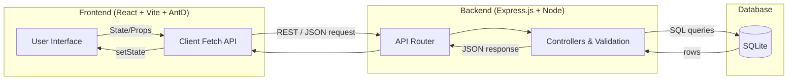
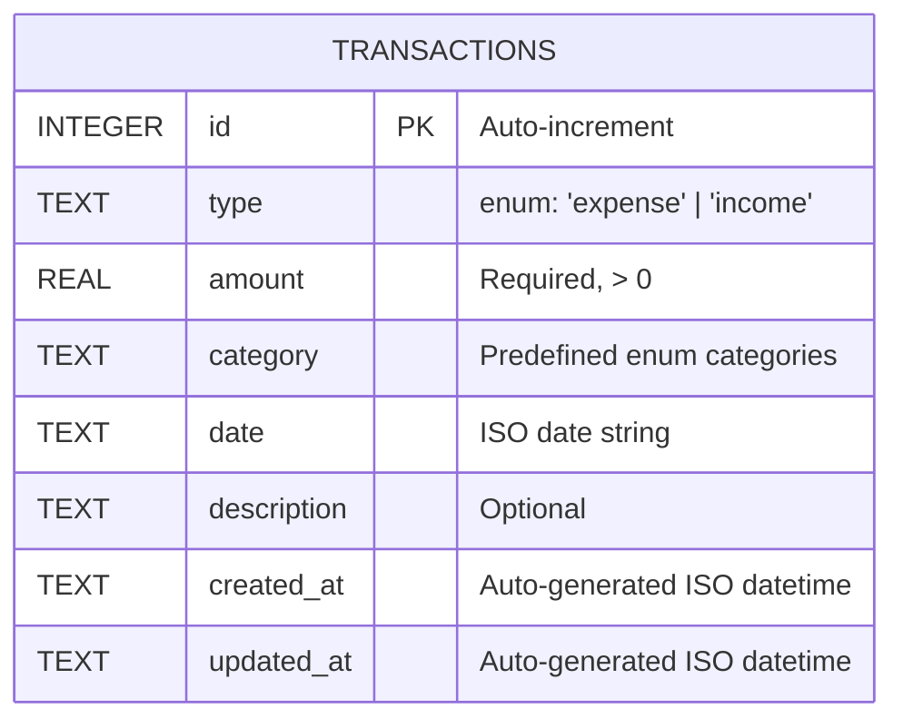
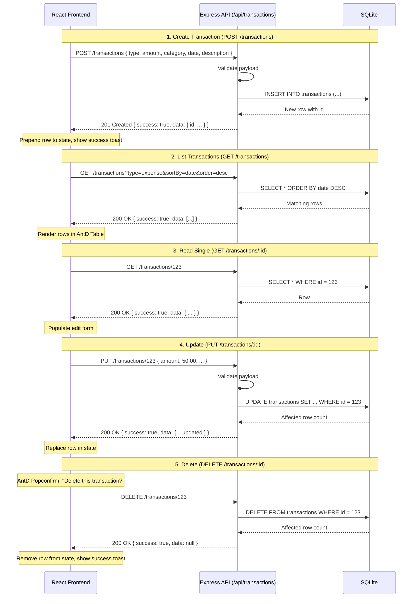
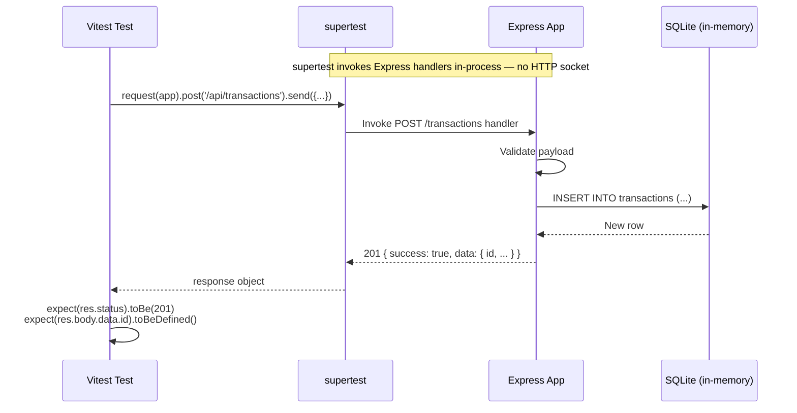

# Defiance Capital Technical Assessment — Specification

## Request Short Name

`defiance-capital-assessment`

---

## 1. Overview

Build a **Daily Expense & Income Diary** full-stack application as a take-home technical assessment for Defiance Capital. The user explicitly declined to clone/install the provided Bitbucket template due to security concerns and received approval from the hiring contact to build an original version and push it to their own GitHub repository.

**Assessment goals:**
- Demonstrate full-stack CRUD skills.
- Produce clean, maintainable code.
- Build a user-friendly, responsive UI.
- Provide at least one API test in an `api/specs` folder.
- Keep scope achievable within a 1–2 hour window.

---

## 2. Constraints & Context

| Item | Decision |
|------|----------|
| Timeline | 1–2 hours (quality over quantity) |
| Repository | New public GitHub repo owned by the candidate |
| Template usage | Do **not** clone/install the Bitbucket template; build from scratch |
| Submission | GitHub repo + optional Loom video (3–5 min) |
| Deployment | Out of scope for now; focus on local development |
| Security priority | Avoid unnecessary dependencies; prefer well-known, scannable packages |

---

## 2.1 System Architecture

The application follows a classic 3-tier client–server architecture.



**Request lifecycle:**

1. User interacts with Ant Design components in the React frontend.
2. React issues an HTTP request via `fetch` to the Express API.
3. Express validates the input and runs an SQL query via `better-sqlite3`.
4. Results flow back through Express → React → UI re-render.

---

## 3. Tech Stack

### 3.1 Frontend
- **Framework:** React 18+
- **Build tool:** Vite
- **Language:** TypeScript
- **UI library:** Ant Design (AntD)
- **State management:** React hooks (`useState`, `useEffect`) only
- **HTTP client:** Fetch API

### 3.2 Backend
- **Runtime:** Node.js
- **Framework:** Express.js (matches the original assessment’s conventions)
- **Language:** TypeScript
- **Database:** SQLite (lightweight, no external DB setup)
- **ORM / query builder:** `better-sqlite3` or lightweight wrapper
- **Testing:** Vitest + supertest

### 3.3 Tooling
- Package manager: `npm`
- TypeScript transpilation: `tsx` or `ts-node` for dev; `tsc` for build
- Linting/formatting: Optional, not required for 1–2h scope

---

## 4. Data Model

### `transactions` table

| Field | Type | Constraints |
|-------|------|-------------|
| `id` | INTEGER | Primary key, auto-increment |
| `type` | TEXT | Required; enum: `expense`, `income` |
| `amount` | REAL | Required; must be > 0 |
| `category` | TEXT | Required; enum or predefined set |
| `date` | TEXT (ISO date) | Required |
| `description` | TEXT | Optional |
| `created_at` | TEXT (ISO datetime) | Auto-generated |
| `updated_at` | TEXT (ISO datetime) | Auto-generated |

### Predefined Categories

- Food
- Transport
- Salary
- Entertainment
- Utilities
- Healthcare
- Others

### 4.1 Entity-Relationship Diagram



Only one table is needed for the MVP. Normalization is intentionally avoided to keep the 1–2h scope.

---

## 5. API Specification

Base URL: `http://localhost:3001/api`

### 5.1 Endpoints

| Method | Endpoint | Description |
|--------|----------|-------------|
| `GET` | `/transactions` | List all transactions (with optional filtering/sorting) |
| `POST` | `/transactions` | Create a new transaction |
| `GET` | `/transactions/:id` | Get a single transaction |
| `PUT` | `/transactions/:id` | Update a transaction |
| `DELETE` | `/transactions/:id` | Delete a transaction |

### 5.2 Query Parameters for `GET /transactions`

| Param | Type | Description |
|-------|------|-------------|
| `type` | `expense` \| `income` | Filter by transaction type |
| `category` | string | Filter by category |
| `sortBy` | `date` \| `amount` | Sort field |
| `order` | `asc` \| `desc` | Sort order |

### 5.3 Request/Response Bodies

**Create / Update payload:**
```json
{
  "type": "expense",
  "amount": 25.50,
  "category": "Food",
  "date": "2024-07-14",
  "description": "Lunch with team"
}
```

**Response envelope:**
```json
{
  "success": true,
  "data": { /* transaction object or array */ }
}
```

### 5.4 Validation Rules

- `type`: required, must be `expense` or `income`
- `amount`: required, number, must be > 0
- `category`: required, must be one of predefined categories
- `date`: required, valid ISO date string
- `description`: optional string

### 5.5 Sequence Diagrams

The single sequence diagram below covers all five CRUD endpoints with their happy paths. Error paths are summarised in prose below the diagram. The frontend is represented by `UI`, the backend by `API`, and the database by `DB`.



**Error responses (common to all endpoints):**

- `400 Bad Request` — validation error (e.g., missing `type`, `amount <= 0`, invalid `category`).
- `404 Not Found` — `GET`/`PUT`/`DELETE` called with an `id` that does not exist.
- `500 Internal Server Error` — unexpected DB failure; return `{ success: false, error }`.

### 5.6 Test Sequence Diagram

The Vitest + supertest test runs against the Express app in-process, so it does not go through HTTP sockets but invokes Express handlers directly.



---

## 6. Frontend Specification

### 6.1 Pages / Components

| Component | Purpose |
|-----------|---------|
| `App` | Root layout, fetches data |
| `TransactionForm` | Form for creating/editing transactions (AntD Form) |
| `TransactionTable` | AntD Table listing all transactions |
| `TransactionFilters` | Filters for type, category, sort |
| `SummaryCards` | Optional: total income, expense, balance |

### 6.2 UI Flow

1. User sees a table of transactions.
2. User clicks **Add** to open a modal/form and create a transaction.
3. User clicks **Edit** to populate the form and update a transaction.
4. User clicks **Delete** to remove a transaction (with confirmation).
5. Filters update the visible list.

### 6.3 Design Notes

- Use Ant Design components: `Table`, `Form`, `Input`, `Select`, `DatePicker`, `Button`, `Modal`, `Card`, `Space`.
- Responsive layout with a max-width container.
- Clear visual distinction between income (green) and expense (red).

---

## 7. Project Structure

```
defiance-capital-assessment/
├── api/
│   ├── src/
│   │   ├── index.ts              # Express app entry
│   │   ├── db.ts                 # SQLite connection & schema setup
│   │   ├── routes/
│   │   │   └── transactions.ts   # CRUD routes
│   │   └── types.ts              # Shared TypeScript types
│   ├── specs/
│   │   └── transactions.spec.ts  # API tests (at least one)
│   ├── package.json
│   ├── tsconfig.json
│   └── vite.config.ts            # Vitest config
├── frontend/
│   ├── src/
│   │   ├── App.tsx
│   │   ├── components/
│   │   │   ├── TransactionForm.tsx
│   │   │   ├── TransactionTable.tsx
│   │   │   └── TransactionFilters.tsx
│   │   ├── types.ts
│   │   └── main.tsx
│   ├── package.json
│   ├── tsconfig.json
│   └── vite.config.ts
├── README.md
└── package.json                  # Optional root workspace script
```

---

## 8. Testing Strategy

- **Backend:** At least one test in `api/specs/transactions.spec.ts` using Vitest + supertest. See §5.6 for the test invocation sequence.
  - Test creating a transaction.
  - Test listing transactions.
  - Test updating a transaction.
  - Test deleting a transaction.
- **Frontend:** Not required for the assessment; manual verification via UI is sufficient given the 1–2h timeline.

---

## 9. Authentication

The original assessment template provided demo credentials for testing. This build does **not** implement authentication. If added later, use a simple hardcoded credential check or a lightweight JWT.

**Decision:** Skip auth for the 1–2h MVP to focus on CRUD functionality.

---

## 10. Development Workflow

### 10.1 Running the Project

```bash
# Backend
cd api
npm install
npm run dev          # starts on PORT from env or 3001

# Frontend
cd frontend
npm install
npm run dev          # starts Vite dev server, usually http://localhost:5173
```

### 10.2 Environment Variables

Backend `.env`:
```
PORT=3001
NODE_ENV=development
```

Frontend `.env`:
```
VITE_API_URL=http://localhost:3001/api
```

---

## 11. Deployment Considerations (Future)

- Backend can be deployed to a VPS, Railway, or Render.
- Frontend can be built and deployed to Vercel/Netlify.
- CORS origins and API URL should be configurable via environment variables.
- SQLite is fine for demo but should be replaced with PostgreSQL/MySQL for production.

---

## 12. Open Questions / Risks

| Risk | Mitigation |
|------|------------|
| Time overrun | Scope strictly to CRUD + one test; skip auth, charts, and deployment |
| Dependency security | Use well-known packages; avoid obscure or unaudited libraries |
| SQLite concurrency | Acceptable for single-user demo |

---

## 13. Acceptance Criteria

- [ ] Backend exposes all CRUD endpoints.
- [ ] At least one API test passes.
- [ ] Frontend can create, read, update, and delete transactions.
- [ ] Frontend uses Ant Design components.
- [ ] UI is responsive and visually clean.
- [ ] README includes setup and run instructions.
- [ ] Code is pushed to a public GitHub repository.

---

*Generated from interview rounds on 2026-07-14.*
